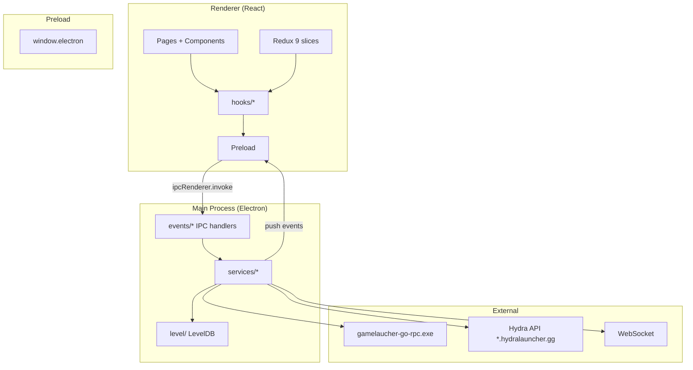
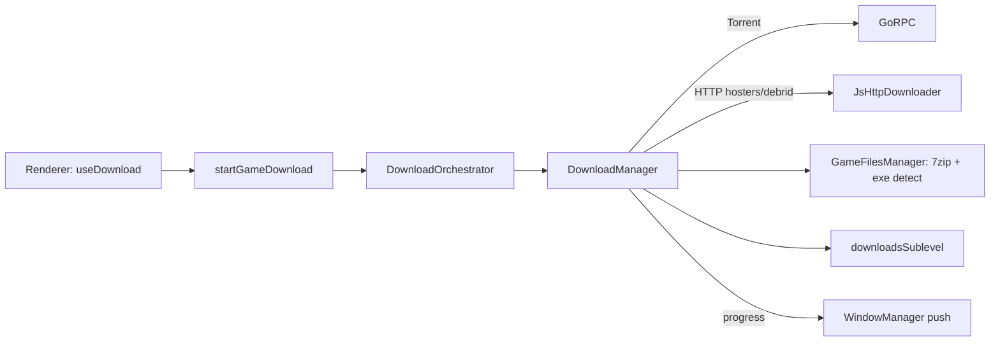
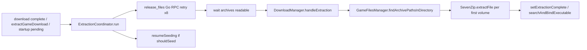
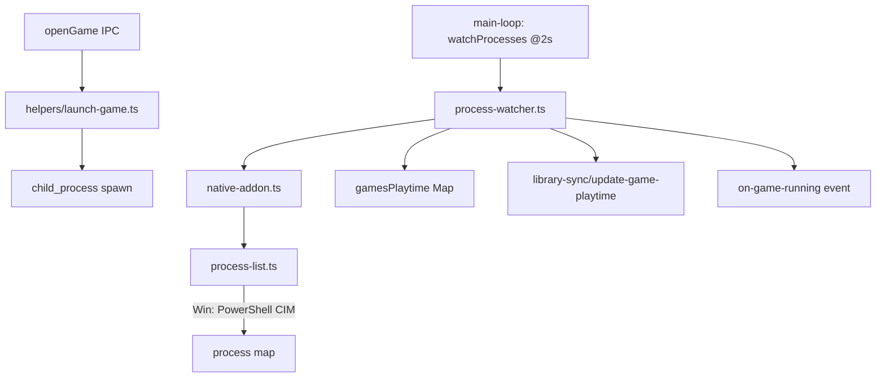

# SRC Skeleton Map

> Bản đồ xương sống của `src/` — đọc file này thay vì quét toàn bộ ~600 file.
> Cập nhật: 2026-07-13. Conventions: `.cursorrules`, fork traits: `CLAUDE.md`.

## Tổng quan kiến trúc



**Luồng dữ liệu chính:** Renderer gọi `window.electron.*` → IPC handler (`registerEvent`) → Service → LevelDB / network / Go RPC → push event về renderer (`WindowManager.sendToAppWindows`).

---

## Cây thư mục (file count)

| Khu vực         | Files                 | Vai trò                                  |
| --------------- | --------------------- | ---------------------------------------- |
| `src/main/`     | 258                   | Backend Electron: IPC, services, LevelDB |
| `src/renderer/` | 287                   | UI React (trong `renderer/src/`)         |
| `src/preload/`  | 1                     | IPC bridge `index.ts` (~820 dòng)        |
| `src/shared/`   | 9                     | Code dùng chung main+renderer            |
| `src/types/`    | 9                     | TypeScript contracts                     |
| `src/locales/`  | 34×`translation.json` | i18n (fork thêm `vi`)                    |

```
src/
├── main/
│   ├── index.ts              # Entry: DNS, splash, protocols, deep links
│   ├── main.ts               # loadState() + loadStateDeferred()
│   ├── constants.ts          # Portable paths, intervals
│   ├── events/               # ~136 IPC handlers (registerEvent)
│   ├── helpers/              # launch-game, download helpers, migrations
│   ├── level/                # classic-level DB + sublevels
│   ├── generated/            # envelope.ts (WS protobuf framing)
│   └── services/             # Business logic
├── renderer/src/
│   ├── main.tsx              # Routes + Redux Provider
│   ├── store.ts              # 9 Redux slices
│   ├── pages/                # Route pages
│   ├── components/           # Shared UI
│   ├── hooks/                # IPC-wrapping hooks
│   ├── features/             # Redux slices
│   ├── context/              # Page contexts
│   └── services/             # leveldb.service.ts
├── preload/index.ts          # window.electron API surface
├── shared/                   # constants, config, download-directories
├── types/                    # level.types, game.types, download.types, …
└── locales/{lang}/translation.json
```

---

## Bootstrap sequence

```
index.ts
  ├─ import cloudflare-dns (FIRST — trước mọi network)
  ├─ single-instance lock
  ├─ hydralauncher:// protocol
  ├─ app.whenReady
  │    ├─ installChromiumCloudflareDns()
  │    ├─ openSplashWindow()
  │    ├─ loadState()          ← critical path (offline-safe)
  │    ├─ openMainWindow()
  │    └─ loadStateDeferred()  ← background (network/RPC)
  └─ deep link / second-instance handlers
```

### `loadState()` — phải nhanh, không chờ network

| Bước | File                                         | Việc làm                         |
| ---- | -------------------------------------------- | -------------------------------- |
| 1    | `services/lock.ts`                           | Acquire LevelDB lock             |
| 2    | `events/index.ts`                            | Register tất cả IPC handlers     |
| 3    | `services/download/*-debrid.ts`, `torbox.ts` | Authorize debrid tokens từ prefs |
| 4    | `services/hosters/gofile.ts`                 | GofileApi.initialize()           |
| 5    | `services/ludusavi.ts`                       | Copy binary/config → userData    |
| 6    | `services/api-client.ts`                     | setupApi() — đọc auth từ LevelDB |
| 7    | `helpers/ensure-downloads-path.ts`           | Tạo `<exe>/game` nếu thiếu       |
| 8    | `services/download/download-manager.ts`      | Pre-warm GoRPC (void)            |

### `loadStateDeferred()` — sau khi UI hiện

| Bước       | Việc làm                                                                                                                            |
| ---------- | ----------------------------------------------------------------------------------------------------------------------------------- |
| Background | uploadGamesBatch, migrateDownloadSources, syncDownloadSourcesFromApi, seedDownloadSources, DownloadSourcesChecker, WSClient.connect |
| Downloads  | DownloadOrchestrator.bootstrapDownloadsOnStartup → resume/seed                                                                      |
| Loop       | startMainLoop() — 5 polling loops @ 2s                                                                                              |
| Misc       | CommonRedistManager, SystemPath check                                                                                               |

---

## Portable paths (`main/constants.ts`)

| Key                                                          | Path                                          | Ghi chú                      |
| ------------------------------------------------------------ | --------------------------------------------- | ---------------------------- |
| `executableBaseDir`                                          | `PORTABLE_EXECUTABLE_DIR` / install dir / cwd | Gốc portable                 |
| `levelDatabasePath`                                          | `<exe>/save/dp`                               | LevelDB duy nhất             |
| `savesPath`                                                  | `<exe>/save`                                  | Cloud-sync artifacts (local) |
| `defaultDownloadsPath`                                       | `<exe>/game`                                  | Thư mục tải mặc định         |
| `logsPath`, `ASSETS_PATH`, `THEMES_PATH`, `commonRedistPath` | `userData/...`                                | Không portable               |

---

## LevelDB schema

**Root keys** (`level/sublevels/keys.ts`): `auth`, `user`, `userPreferences`, `language`, `rpcPassword`, `screenState`, `commonRedistPassed`, `downloadSourcesCheckBaseline`, `downloadSourcesSinceValue`.

**Sublevels** (`level/sublevels/`):

| Sublevel              | Key pattern                | TTL / Notes                     |
| --------------------- | -------------------------- | ------------------------------- |
| `games`               | `{shop}:{objectId}`        | Library games                   |
| `downloads`           | `{shop}:{objectId}`        | Active/completed downloads      |
| `downloadLayoutState` | singleton                  | `queueOrder[]`, `pausedOrder[]` |
| `gameShopAssets`      | per game                   | 8h cache                        |
| `gameShopCache`       | `{shop}:{objectId}:{lang}` | Shop details                    |
| `gameStatsAssets`     | per game                   | 30m cache                       |
| `gameAchievements`    | per game                   | Local achievement cache         |
| `downloadSources`     | per source                 | Repack mirrors                  |
| `themes`              | per theme                  | Custom themes                   |
| `localNotifications`  | per notification           | In-app notifications            |

**Types:** `types/level.types.ts` — `Game`, `Download`, `UserPreferences`, `DownloadLayoutState`, `Auth`, `GameAchievement`.

**Renderer truy cập trực tiếp** qua `window.electron.leveldb.*` (generic CRUD IPC).

---

## IPC surface

**Pattern:** `registerEvent(channelName, handler)` trong `events/register-event.ts` — deep-clone kết quả qua JSON.

**Preload sections** (`preload/index.ts`):

| Section          | Channels (invoke)                                                                                                                                                                                                                                                                                       |
| ---------------- | ------------------------------------------------------------------------------------------------------------------------------------------------------------------------------------------------------------------------------------------------------------------------------------------------------- |
| Torrenting       | `startGameDownload`, `addGameToQueue`, `cancelGameDownload`, `pauseGameDownload`, `resumeGameDownload`, `pauseGameSeed`, `resumeGameSeed`, `updateDownloadQueuePosition`, `setDownloadQueuePosition`, `setPausedDownloadPosition`, `moveDownloadPlacement`, `getDownloadLayoutState`, `getTorrentFiles` |
| Catalogue        | `getGameShopDetails`, `getRandomGame`, `getGameStats`, `getGameAssets`                                                                                                                                                                                                                                  |
| User preferences | `getUserPreferences`, `updateUserPreferences`, `authenticateRealDebrid`, `authenticateAllDebrid`, `authenticatePremiumize`, `authenticateTorbox`, `autoLaunch`                                                                                                                                          |
| Download sources | `getDownloadSources`, `addDownloadSource`, `removeDownloadSource`, `syncDownloadSources`, `getDownloadSourcesCheckBaseline`, `getDownloadSourcesSinceValue`                                                                                                                                             |
| Library          | `getLibrary`, `openGame`, `closeGame`, `addGameToLibrary`, `removeGameFromLibrary`, `scanInstalledGames`, `extractGameDownload`, `transferGameFiles`, `getAvailableDrives`, `cancelGameTransfer`, … (40+ handlers)                                                                                      |
| Hardware         | `getDiskFreeSpace`, `checkFolderWritePermission`                                                                                                                                                                                                                                                        |
| Cloud save       | `getGameArtifacts`, `getGameBackupPreview`, `downloadGameArtifact`, `deleteGameArtifact`, `uploadSaveGame`, `selectGameBackupPath`                                                                                                                                                                      |
| Misc             | `apiCall`, `openExternal`, `showOpenDialog`, `showItemInFolder`, `installCommonRedist`, `getDefaultDownloadsPath`, `ping`, `getVersion`, …                                                                                                                                                              |
| Profile          | `getMe`, `updateProfile`, `processProfileImage`                                                                                                                                                                                                                                                         |
| User             | `getAuth`, `getUnlockedAchievements`, `getComparedUnlockedAchievements`                                                                                                                                                                                                                                 |
| Auth             | `openAuthWindow`, `signOut`, `getSessionHash`                                                                                                                                                                                                                                                           |
| Notifications    | `getLocalNotifications`, `markLocalNotificationRead`, `publishNewRepacksNotification`, …                                                                                                                                                                                                                |
| Themes           | `getAllCustomThemes`, `addCustomTheme`, `toggleCustomTheme`, `openEditorWindow`, …                                                                                                                                                                                                                      |
| LevelDB          | `leveldbGet`, `leveldbPut`, `leveldbDel`, `leveldbClear`, `leveldbValues`, `leveldbIterator`                                                                                                                                                                                                            |

**Push events** (main → renderer, `ipcRenderer.on`):

| Event                                      | Nguồn            | Payload                    |
| ------------------------------------------ | ---------------- | -------------------------- |
| `on-download-progress`                     | DownloadManager  | `DownloadProgress \| null` |
| `on-seeding-status`                        | DownloadManager  | `SeedingStatus[]`          |
| `on-downloads-updated`                     | WindowManager    | —                          |
| `on-game-running`                          | process-watcher  | `GameRunning`              |
| `on-update-achievements-{shop}-{objectId}` | achievements     | `GameAchievement[]`        |
| `on-user-preferences-updated`              | user-preferences | `UserPreferences`          |
| `on-hard-delete`                           | misc             | —                          |

**REST proxy:** `window.electron.api.*` → `misc/api-call.ts` → `ApiClient` (Axios + JWT refresh).

---

## Download system



### Dispatch (`download-manager.ts`)

| `Downloader` enum | Transport                | Resolver                 |
| ----------------- | ------------------------ | ------------------------ |
| `Torrent` (0)     | Go RPC JSON stdin/stdout | `go-rpc.ts`              |
| `RealDebrid` (1)  | JS HTTP                  | `real-debrid.ts`         |
| `Gofile` (2)      | JS HTTP                  | `hosters/gofile.ts`      |
| `PixelDrain` (3)  | JS HTTP                  | `hosters/pixeldrain.ts`  |
| `Datanodes` (4)   | JS HTTP                  | `hosters/datanodes.ts`   |
| `Mediafire` (5)   | JS HTTP                  | `hosters/mediafire.ts`   |
| `TorBox` (6)      | JS HTTP                  | `torbox.ts`              |
| `Buzzheavier` (8) | JS HTTP                  | `hosters/buzzheavier.ts` |
| `FuckingFast` (9) | JS HTTP                  | `hosters/fuckingfast.ts` |
| `VikingFile` (10) | JS HTTP                  | `hosters/vikingfile.ts`  |
| `Rootz` (11)      | JS HTTP                  | `hosters/rootz.ts`       |
| `Premiumize` (12) | JS HTTP                  | `premiumize.ts`          |
| `AllDebrid` (13)  | JS HTTP (batch path)     | `all-debrid.ts`          |

Gap tại 7 = Nimbus đã xóa. Enum pinned — không đổi số.

### Queue / layout

- `DownloadOrchestrator` — facade công khai: start/pause/resume/cancel, queue order
- `download-layout-state.ts` — persist `queueOrder` + `pausedOrder` trong LevelDB
- `download-orchestrator.ts` — `bootstrapDownloadsOnStartup()`, `moveDownloadPlacement()`

### Post-download / extraction (Jul 2026 fix)



| File                                    | Role                                                         |
| --------------------------------------- | ------------------------------------------------------------ |
| `services/extraction-coordinator.ts`    | Single entry: prepare → extract → restore seed               |
| `services/download/download-manager.ts` | `releaseTorrentFiles`, `handleExtraction`                    |
| `services/game-files-manager.ts`        | `findArchivePathsInDirectory`, extract in-place              |
| `services/7zip.ts`                      | node-7z wrapper, password + integrity + lock handling        |
| `shared/archive.ts`                     | `isArchiveFile` / `isFirstArchiveVolume` (incl. `.rar.part`) |
| `shared/constants.ts`                   | `REPACK_ARCHIVE_PASSWORDS`                                   |
| `go_rpc/torrent_downloader.go`          | `release_files` action drops torrent handles before extract  |

Online-Fix layout: `game\<Name>\` often has main `*.rar(.part)` + `Fix Repair\*.rar(.part)`.
Torrent seeding **locks** archives — `pause_seeding` is insufficient; must `release_files` first.

### Multi download directories (fork)

`shared/download-directories.ts` — tối đa 5 thư mục, resolve default + optional paths từ `UserPreferences`.

---

## Go torrent RPC

| File                                        | Vai trò                                          |
| ------------------------------------------- | ------------------------------------------------ |
| `go_rpc/main.go`                            | Source                                           |
| `gamelaucher-go-rpc/gamelaucher-go-rpc.exe` | Binary runtime                                   |
| `services/go-rpc.ts`                        | `GoRPC` class — spawn, JSON-RPC lines, port 5881 |

Methods: `status`, `seed_status`, `torrent_files`, `action` (start/pause/cancel/**release_files**/pause_seeding/resume_seeding).

Transport: HTTP `http://127.0.0.1:5882/rpc` (`services/go-rpc.ts`), not stdin/stdout.

> Tên cũ `PythonRPC`/`python-rpc.ts` đã đổi thành `GoRPC`/`go-rpc.ts`.

---

## Game launch & playtime



- `process-list.ts` — pure Node process listing (PowerShell trên Windows, `/proc` trên Linux)
- `native-addon.ts` — stub delegate tới `process-list`; profile image = pass-through (không convert)
- `close-game.ts` — kill process qua `NativeAddon.listProcesses()`

---

## Main services catalog

| Service                | File                                                     | Trách nhiệm                               |
| ---------------------- | -------------------------------------------------------- | ----------------------------------------- |
| ApiClient              | `api-client.ts`                                          | JWT REST, refresh, `apiCall` IPC          |
| DownloadManager        | `download/download-manager.ts`                           | Download dispatch, watch, seed            |
| DownloadOrchestrator   | `download-orchestrator.ts`                               | Queue/layout facade                       |
| GoRPC                  | `go-rpc.ts`                                              | Torrent subprocess                        |
| JsHttpDownloader       | `download/js-http-downloader.ts`                         | HTTP fetch + resume + throttle            |
| GameFilesManager       | `game-files-manager.ts`                                  | Extract, exe detect, shortcuts            |
| WindowManager          | `window-manager.ts`                                      | Windows, CORS/UA headers, push events     |
| CloudSync              | `cloud-sync.ts`                                          | Ludusavi → tar → `savesPath` (local only) |
| WSClient               | `ws/ws-client.ts`                                        | WebSocket protobuf Envelope               |
| LibrarySync            | `library-sync/*`                                         | Sync games/playtime với API               |
| AchievementWatcher     | `achievements/*`                                         | Scan cracker files → notify               |
| CloudflareDns          | `cloudflare-dns.ts`                                      | DoH 1.1.1.1 + Node dns override           |
| Lock                   | `lock.ts`                                                | Single-writer LevelDB lock                |
| Ludusavi               | `ludusavi.ts`                                            | Save backup tool wrapper                  |
| CommonRedistManager    | `common-redist-manager.ts`                               | VC++ redist installer                     |
| ProcessWatcher         | `process-watcher.ts`                                     | Playtime + running game detection         |
| ProcessList            | `process-list.ts`                                        | OS process enumeration                    |
| NativeAddon            | `native-addon.ts`                                        | Facade → process-list                     |
| MainLoop               | `main-loop.ts`                                           | 5 infinite polling loops                  |
| PowerSaveBlocker       | `power-save-blocker.ts`                                  | Prevent sleep during download/game        |
| Wine / UMU             | `wine.ts`, `umu.ts`                                      | Linux compatibility launch                |
| Steam / Steam250       | `steam.ts`, `steam-250.ts`                               | Steam integration helpers                 |
| DownloadSourcesChecker | `download-sources-checker.ts`                            | Poll repack source updates                |
| Hosters                | `hosters/*.ts`                                           | URL resolvers per file host               |
| Debrid                 | `download/{real-debrid,all-debrid,premiumize,torbox}.ts` | Debrid link unrestrict                    |

---

## Renderer architecture

### Routes (`renderer/src/main.tsx`)

| Path                        | Page                    | Context              |
| --------------------------- | ----------------------- | -------------------- |
| `/`                         | Home                    | —                    |
| `/catalogue`                | Catalogue               | —                    |
| `/library`                  | Library                 | —                    |
| `/downloads`                | Downloads               | —                    |
| `/game/:shop/:objectId`     | GameDetails             | `GameDetailsContext` |
| `/settings`                 | Settings                | `SettingsContext`    |
| `/achievements`             | Achievements            | —                    |
| `/notifications`            | Notifications           | —                    |
| `/theme-editor`             | ThemeEditor             | standalone window    |
| `/achievement-notification` | AchievementNotification | overlay window       |
| `/game-launcher`            | GameLauncher            | mini launcher window |

Shell: `App` = Sidebar + Header + `<Outlet>` + BottomPanel.

### Redux slices (`features/`)

`window`, `library`, `userPreferences`, `download`, `toast`, `userDetails`, `gameRunning`, `catalogueSearch`, `collections`

### Hooks → IPC mapping

| Hook                         | IPC chính                            |
| ---------------------------- | ------------------------------------ |
| `useDownload`                | torrenting + `onDownloadProgress`    |
| `useDownloadLayout`          | `getDownloadLayoutState`, queue move |
| `useLibrary`                 | `getLibrary`, library mutations      |
| `useCatalogue`               | `api` + catalogue IPC                |
| `useUserDetails`             | `getMe`, `getAuth`                   |
| `useGameCollections`         | leveldb collections                  |
| `useFeature`                 | subscription gates                   |
| `useDownloadOptionsListener` | repack notifications                 |

### Intra-renderer bus

`window` CustomEvents prefix `gl:` (đã de-brand từ `hydra:`):

- `gl:openGameOptions`, `gl:openRepacks`, `gl:game-favorite-toggled`, `gl:game-removed-from-library`, `gl:game-files-removed`

### Contexts

- `GameDetailsContext` — game page state, repacks, download options
- `SettingsContext` — settings tabs, debrid auth
- `CloudSyncContext` — save backup UI

---

## Shared & types

### `shared/`

| File                      | Export chính                                          |
| ------------------------- | ----------------------------------------------------- |
| `constants.ts`            | `Downloader`, `Cracker`, `DownloadError`, `AuthPage`  |
| `config.ts`               | `appConfig` URLs (api, auth, ws, nimbus)              |
| `index.ts`                | `getDownloadersForUri()`, `formatBytes`, `parseBytes` |
| `download-directories.ts` | Multi-dir resolve, max 5 paths                        |
| `archive.ts`              | `isArchiveFile()`                                     |
| `html-sanitizer.ts`       | DOMPurify wrapper                                     |
| `use-hls-video.ts`        | HLS hook (renderer)                                   |

### `types/`

| File                                                                                 | Chứa                                         |
| ------------------------------------------------------------------------------------ | -------------------------------------------- |
| `level.types.ts`                                                                     | LevelDB entities                             |
| `game.types.ts`                                                                      | `GameShop`, Steam types                      |
| `download.types.ts`                                                                  | `DownloadStatus`, progress DTOs              |
| `download-contract.ts`                                                               | Placement/bucket helpers                     |
| `index.ts`                                                                           | API DTOs (catalogue, profile, notifications) |
| `theme.types.ts`, `steam.types.ts`, `ludusavi.types.ts`, `how-long-to-beat.types.ts` | Domain-specific                              |

---

## Main helpers (`main/helpers/`)

| File                            | Dùng khi                           |
| ------------------------------- | ---------------------------------- |
| `launch-game.ts`                | `openGame` — spawn exe/wine/proton |
| `resolve-launch-command.ts`     | Build launch argv                  |
| `download-game-helper.ts`       | Start download từ game details     |
| `download-error-handler.ts`     | Map errors → `DownloadError` enum  |
| `ensure-downloads-path.ts`      | mkdir `<exe>/game`                 |
| `migrate-download-sources.ts`   | One-time LevelDB migration         |
| `seed-download-sources.ts`      | Seed default repack sources        |
| `is-gamemode-available.ts` etc. | Linux tool detection               |

---

## Events helpers (`main/events/helpers/`)

| File                       | Dùng bởi                           |
| -------------------------- | ---------------------------------- |
| `get-downloads-path.ts`    | Resolve download path cho game     |
| `get-directory-size.ts`    | Folder size (transfer, seed check) |
| `find-game-root.ts`        | Locate game install root           |
| `parse-executable-path.ts` | Normalize exe path                 |
| `parse-launch-options.ts`  | Parse launch args                  |

---

## Fork-specific (khác upstream Hydra)

1. **Go RPC** thay Python — `go-rpc.ts`, binary `gamelaucher-go-rpc.exe`
2. **Portable storage** — DB/saves/downloads cạnh exe
3. **JS HTTP downloader** — không qua RPC cho hosters/debrid
4. **Multi download directories** — `download-directories.ts`
5. **Cross-drive transfer** — `transfer-game-files.ts`
6. **Cloudflare DNS** — `cloudflare-dns.ts` installed first in `index.ts`
7. **Process listing restored** — `process-list.ts` via `native-addon.ts` stub (không còn Rust)
8. **De-branded** — `ApiClient`, `gl:` events, `PointsIcon`, no auto-updater, no big-picture, no social
9. **Locale `vi`** — default i18n lng = `"vi"` in `index.ts`
10. **Splash window** — fast perceived startup
11. **Split startup** — `loadState` (fast) vs `loadStateDeferred` (network)

---

## Khi sửa feature X → đọc file nào

| Feature             | Entry points                                                                                           |
| ------------------- | ------------------------------------------------------------------------------------------------------ |
| Thêm downloader mới | `shared/constants.ts` enum → `download-manager.ts` dispatch → resolver file → `getDownloadersForUri()` |
| Download UI         | `pages/downloads/` → `useDownload` → `preload` torrenting section                                      |
| Game launch         | `events/library/open-game.ts` → `helpers/launch-game.ts`                                               |
| Playtime            | `process-watcher.ts` → `library-sync/update-game-playtime.ts`                                          |
| Library scan        | `events/library/scan-installed-games.ts` → `game-executables.ts`                                       |
| Save backup         | `events/cloud-save/*` → `cloud-sync.ts` → `ludusavi.ts`                                                |
| Repacks             | `events/download-sources/*` → `download-sources-checker.ts`                                            |
| Themes              | `events/themes/*` → `level/sublevels/themes.ts`                                                        |
| Settings path       | `pages/settings/` → `SettingsContext` → `updateUserPreferences`                                        |
| API call mới        | Renderer `window.electron.api` → `api-client.ts`                                                       |
| LevelDB key mới     | `types/level.types.ts` → `level/sublevels/keys.ts` → sublevel file                                     |
| Thêm IPC            | `events/{group}/handler.ts` + `registerEvent` → `preload/index.ts` → hook (nếu cần)                    |

---

## Known gotchas

- `getDownloadPayload()` trong download-manager có dead branches HTTP (legacy RPC era)
- `CloudSync` tên "cloud" nhưng chỉ local (`savesPath`)
- `Subscription` types còn nhưng subscription slice đã xóa khỏi renderer
- `profile` IPC tồn tại nhưng không có profile page
- WS chỉ handle `notification` event (friends/social WS events đã xóa)
- `@protobuf-ts/runtime` nên là direct dep (hiện transitive)
